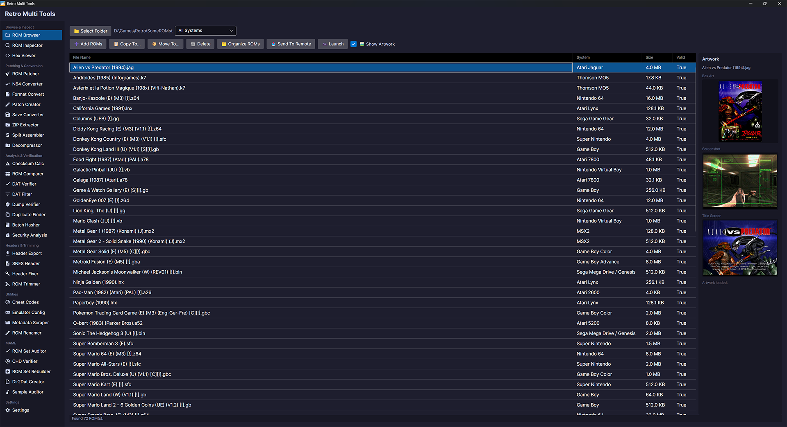

<div align="center">

# Retro Multi Tools



A cross-platform desktop utility for managing, inspecting, and patching retro game ROMs.

[](LICENSE)
[](https://dotnet.microsoft.com/download/dotnet/8.0)
[](#)

</div>

## Table of Contents

- [Downloads](#downloads)
- [Platform Guides](#platform-guides)
- [Documentation](#documentation)
- [Features](#features)
- [Supported Systems](#supported-systems)
- [Localization](#localization)
- [Building from Source](#building-from-source)
- [License](#license)

## Downloads

Download the latest release from the [Releases](https://github.com/SvenGDK/RetroMultiTools/releases) page.

| File | Description |
|---|---|
| `win-x64.zip` | Windows 64-bit (Intel/AMD) |
| `win-arm64.zip` | Windows ARM64 |
| `linux-x64.zip` | Linux 64-bit (Intel/AMD) |
| `linux-arm64.zip` | Linux ARM64 |
| `osx-x64.zip` | macOS Intel |
| `osx-arm64.zip` | macOS Apple Silicon |

Self-contained builds (e.g. `win-x64-selfcontained.zip`) include the .NET runtime and do not require a separate installation.
Framework-dependent builds require the [.NET 8 Runtime](https://dotnet.microsoft.com/download/dotnet/8.0).

## Platform Guides

- **Windows** — Install the [.NET 8 Runtime](https://dotnet.microsoft.com/download/dotnet/8.0), extract the ZIP, and run `RetroMultiTools.exe`.
- **Linux** — See [LINUX.md](LINUX.md) for required packages and step-by-step instructions.
- **macOS** — See [macOS.md](macOS.md) for installation steps and Gatekeeper notes.

## Documentation

For detailed user guides and reference material, see the [full documentation](docs/README.md).

- [ROM Browser & RetroArch Integration Guide](docs/features/rom-browser-guide.md) — step-by-step guide to browsing, managing, and launching ROMs with RetroArch

## Features

### Browsing & Inspection

<details>
<summary><strong>ROM Browser</strong></summary>

- Scan directories recursively for ROM files across 32 console and computer types
- Filter ROMs by system
- Organize ROM collections into system-specific folders
- View box art, screenshots, and title screens for selected ROMs
- Send selected ROMs to remote targets via FTP, SFTP, WebDAV, or Amazon S3

</details>

<details>
<summary><strong>ROM Inspector</strong></summary>

- Detect and display ROM system type from headers and file extensions
- Parse detailed header information (title, mapper, ROM/RAM size, checksums, etc.)
- Fetch box art, screenshots, and title screens from the [Libretro Thumbnails](https://github.com/libretro-thumbnails) database

</details>

<details>
<summary><strong>Hex Viewer</strong></summary>

- View ROM file contents in hexadecimal format with ASCII sidebar
- Page-based navigation through files of any size
- Go to specific offset by hex address
- Byte pattern search across the entire file

</details>

### Patching

<details>
<summary><strong>ROM Patcher</strong></summary>

- Apply **IPS** patches (with RLE support and optional truncation)
- Apply **BPS** patches (with full CRC32 validation of source, target, and patch data)

</details>

<details>
<summary><strong>IPS Patch Creator</strong></summary>

- Create IPS patches by comparing an original ROM file with a modified version
- Automatic analysis shows file sizes, differing byte count, and format compatibility
- RLE compression for repeated byte sequences
- Supports files up to 16 MB (IPS format limit)

</details>

### Conversion & Extraction

<details>
<summary><strong>N64 Format Converter</strong></summary>

- Convert between N64 ROM byte orders: `.z64` (Big Endian), `.n64` (Little Endian), `.v64` (Byte-swapped)
- Auto-detects source format from ROM header magic bytes

</details>

<details>
<summary><strong>ROM Format Converter</strong></summary>

- Add or remove 512-byte copier headers from ROM dumps
- Remove iNES headers or fix dirty iNES header bytes
- Convert disc images to CHD (Compressed Hunks of Data) format via chdman
- Convert GameCube/Wii ISOs to RVZ (Dolphin compressed) format via DolphinTool
- Single file or batch conversion for entire directories

</details>

<details>
<summary><strong>Save File Converter</strong></summary>

- Convert save files between formats (.sav, .srm, .eep, .fla, .sra)
- Swap endianness (16-bit or 32-bit) for cross-platform save compatibility
- Pad save files to the next power-of-two size for flash cart compatibility
- Trim trailing padding bytes (0x00 / 0xFF) from oversized save files
- Detects save type (EEPROM, SRAM, Flash) from file size

</details>

<details>
<summary><strong>ZIP ROM Extractor</strong></summary>

- Extract ROM files from ZIP archives
- Lists archive contents with compressed and uncompressed sizes
- Batch extraction from a directory of ZIP files

</details>

<details>
<summary><strong>Split ROM Assembler</strong></summary>

- Reassemble split ROM files (.001/.002, .part1/.part2, .z01/.z02) into a single file
- Auto-detects all parts from the first part file
- Shows detected parts with individual sizes before assembly

</details>

<details>
<summary><strong>ROM Decompressor</strong></summary>

- Decompress GZip-compressed ROM files (.gz)
- Single file or batch decompression from a directory
- Reports compressed and decompressed sizes

</details>

### Verification & Analysis

<details>
<summary><strong>Checksum Calculator</strong></summary>

- Compute CRC32, MD5, SHA-1, and SHA-256 checksums for any ROM file
- Streaming I/O handles large ISO/BIN images without loading into memory
- Selectable hash values for easy copy to clipboard

</details>

<details>
<summary><strong>ROM Comparer</strong></summary>

- Streaming byte-by-byte binary comparison of two files
- Reports identical/different status, differing byte count, and first mismatch offset

</details>

<details>
<summary><strong>DAT Verifier</strong></summary>

- Verify ROM files against No-Intro and TOSEC DAT files (CLRMAMEPro / Logiqx XML format)
- Match ROMs by CRC32, MD5, or SHA-1 checksums against known-good dumps
- Single ROM or batch directory verification

</details>

<details>
<summary><strong>DAT Filter</strong></summary>

- Filter DAT file entries using Retool-like logic
- Category exclusion: demos, betas, prototypes, samples, unlicensed, BIOS, applications, pirate editions
- Region and language priority filtering
- 1G1R (One Game, One ROM) deduplication for No-Intro / Redump naming conventions
- Export filtered results as Logiqx XML format

</details>

<details>
<summary><strong>Dump Verifier</strong></summary>

- Verify ROM dump integrity by checking for overdumps, underdumps, blank regions, and bad headers
- Validates file sizes against expected sizes for each system
- Power-of-two size checks and trailing padding analysis

</details>

<details>
<summary><strong>Duplicate Finder</strong></summary>

- Scan directories recursively to find duplicate ROMs by CRC32 hash
- Shows duplicate groups with file paths and wasted disk space

</details>

<details>
<summary><strong>Batch ROM Hasher</strong></summary>

- Calculate CRC32, MD5, SHA-1, and SHA-256 checksums for all ROM files in a directory
- Selectable hash algorithms for speed vs. completeness
- Export results as CSV, text report, SFV checksum, or MD5 sum file

</details>

<details>
<summary><strong>Security & DRM Analysis</strong></summary>

- Detect region locking for all supported systems
- Identify copy protection mechanisms (10NES, CIC chips, TMSS, Nintendo logo checks, Lynx encryption, Atari 7800 digital signature, ColecoVision BIOS check, Intellivision EXEC handshake, Jaguar encrypted boot, MSX cartridge marker, Sega CD security ring)
- Validate checksum integrity (SNES internal checksums, N64 CRC, Game Boy header checksums, GBA header checksums, Mega Drive internal checksums, iNES headers)
- Single ROM or batch directory analysis

</details>

### ROM Management

<details>
<summary><strong>Header Export</strong></summary>

- Export ROM header information to text reports or CSV files
- Batch export for entire directories with system summary

</details>

<details>
<summary><strong>SNES Copier Header Tool</strong></summary>

- Detect, add, and remove the 512-byte copier header found in some SNES ROM dumps
- Useful for compatibility with different emulators and flash carts

</details>

<details>
<summary><strong>Batch Header Fixer</strong></summary>

- Fix ROM headers for all supported ROMs in a directory
- Supported operations:
  - SNES internal checksum recalculation
  - NES header cleanup
  - Game Boy / GBC header and global checksum
  - GBA header checksum
  - Mega Drive / Genesis checksum
  - Sega 32X checksum
  - SMS / Game Gear TMR SEGA checksum
  - N64 CRC1/CRC2 checksum (CIC-NUS-6102)
  - Atari 7800 header validation
  - Atari Lynx LYNX header cleanup
  - PC Engine copier header cleanup
  - Virtual Boy header validation
  - Neo Geo Pocket header validation
  - Atari Jaguar header validation
  - MSX cartridge header validation
  - ColecoVision header validation
  - Watara Supervision header validation
- Single file or batch processing

</details>

<details>
<summary><strong>ROM Trimmer</strong></summary>

- Analyze and trim trailing padding bytes (0x00 / 0xFF) from ROM files
- Power-of-two size alignment preserves compatibility
- Shows space savings before trimming

</details>

<details>
<summary><strong>ROM Renamer</strong></summary>

- Rename ROM files based on header-detected game titles, regions, and system info
- Preview all renames before applying
- Single file or batch rename for entire directories
- Sanitizes file names for cross-platform compatibility

</details>

<details>
<summary><strong>Metadata Scraper</strong></summary>

- Scrape metadata from ROM files in bulk (header info, checksums, system details)
- Export results to CSV or text reports
- Optional checksum calculation for each ROM

</details>

### Cheats & Emulation

<details>
<summary><strong>Cheat Code Converter</strong></summary>

- Decode and encode Game Genie codes for NES, SNES, Game Boy, Game Boy Color, Sega Genesis, and Game Gear
- Decode and encode Pro Action Replay codes for SNES, Genesis, Game Boy, Master System, Sega 32X, and Sega CD
- Decode and encode N64 GameShark codes (9 code types including write, uncached, repeat, and activator)
- Decode and encode GBA GameShark / Action Replay codes (12 code types)
- Decode and encode Game Boy Color GameShark codes
- Decode and encode PC Engine raw cheat codes (address:value format)
- Decode and encode Neo Geo Pocket GameShark codes
- Shows decoded address, value, and compare value components

</details>

<details>
<summary><strong>Emulator Config Generator</strong></summary>

- Generate configuration files for RetroArch, Mesen, Snes9x, Project64, mGBA, Kega Fusion, Mednafen, Stella, FCEUX, and MAME
- Mednafen supports per-system settings for PC Engine, Lynx, Neo Geo Pocket, SMS, Game Gear, Virtual Boy, NES, SNES, Game Boy, GBA, and Mega Drive
- Configurable video, audio, and input settings
- Set ROM, save, and save-state directory paths

</details>

### Settings

<details>
<summary><strong>RetroArch Core Downloader</strong></summary>

- Auto-detect or manually configure the RetroArch executable path
- Scan for installed libretro cores and identify missing ones
- Download all missing cores from the official RetroArch buildbot
- Supports Windows, Linux, and macOS platforms
- Download progress with cancel support

</details>

### MAME

<details>
<summary><strong>ROM Set Auditor</strong></summary>

- Audit MAME ROM sets against a MAME XML database (from `mame -listxml` or Logiqx DAT)
- Verifies ZIP-packaged ROM sets for completeness, correct CRC32 checksums, and proper file sizes
- Reports good, incomplete, and bad sets with detailed per-ROM status
- Identifies clones and parent ROM relationships
- Detects missing machines in ROM directory

</details>

<details>
<summary><strong>CHD Verifier</strong></summary>

- Verify MAME CHD (Compressed Hunks of Data) file integrity
- Reads and validates CHD v3, v4, and v5 headers
- Reports SHA-1 and raw SHA-1 checksums, compression type, logical size, hunk size, and unit size
- Detects parent CHD dependencies
- Single file or batch directory verification

</details>

<details>
<summary><strong>ROM Set Rebuilder</strong></summary>

- Rebuild MAME ROM sets from scattered or loose ROM files (similar to CLRMamePro Rebuilder)
- Indexes source directory by CRC32 — supports both loose files and files inside ZIP archives
- Creates properly structured ZIP archives matching the MAME XML database
- Option to rebuild only complete sets or include partial sets
- Overwrite or skip existing ZIP files

</details>

<details>
<summary><strong>Dir2Dat Creator</strong></summary>

- Create a DAT file from a directory of ROM files (similar to CLRMamePro Dir2Dat)
- Scans ZIP archives and optionally loose files
- Computes CRC32, SHA-1, and MD5 checksums
- Reads CHD file headers for disk entries
- Exports in Logiqx XML format compatible with CLRMamePro and other ROM managers
- Configurable DAT metadata (name, description, author)

</details>

<details>
<summary><strong>Sample Auditor</strong></summary>

- Audit MAME sample audio files against a MAME XML database
- Verifies that sample ZIP archives contain the expected WAV files for each machine
- Reports good, incomplete, and bad sample sets with missing file details
- Handles shared sample sets (sampleof attribute)
- Detects missing sample sets

</details>

## Supported Systems

| System | Extensions |
|---|---|
| Nintendo Entertainment System (NES) | `.nes` |
| Super Nintendo (SNES) | `.smc`, `.sfc` |
| Nintendo 64 | `.z64`, `.n64`, `.v64` |
| Game Boy | `.gb` |
| Game Boy Color | `.gbc` |
| Game Boy Advance | `.gba` |
| Nintendo Virtual Boy | `.vb`, `.vboy` |
| Sega Master System | `.sms` |
| Sega Mega Drive / Genesis | `.md`, `.gen`, `.bin` |
| Sega CD | `.iso`, `.cue` |
| Sega 32X | `.32x` |
| Sega Game Gear | `.gg` |
| Atari 2600 | `.a26` |
| Atari 5200 | `.a52` |
| Atari 7800 | `.a78` |
| Atari Jaguar | `.j64`, `.jag` |
| Atari Lynx | `.lnx`, `.lyx` |
| PC Engine / TurboGrafx-16 | `.pce`, `.tg16` |
| SNK Neo Geo Pocket / Pocket Color | `.ngp`, `.ngc` |
| Coleco ColecoVision | `.col`, `.cv` |
| Mattel Intellivision | `.int` |
| MSX | `.mx1` |
| MSX2 | `.mx2` |
| Amstrad CPC | `.dsk`, `.cdt`, `.sna` |
| Oric / Atmos / TeleStrat | `.tap` |
| Thomson MO5 | `.mo5`, `.k7`, `.fd` |
| Watara Supervision | `.sv` |
| Radio Shack Color Computer | `.ccc` |
| Panasonic 3DO | `.3do`, `.iso`, `.cue` |
| Amiga CD32 | `.iso`, `.cue` |
| Sega Saturn | `.iso`, `.cue` |
| Sega Dreamcast | `.cdi`, `.gdi`, `.iso`, `.cue` |
| Nintendo GameCube | `.gcm`, `.iso` |
| Nintendo Wii | `.iso` |

### System Feature Coverage

| System | Header Parsing | Security Analysis | Dump Verification | Cheat Codes | Header Fixing |
|---|---|---|---|---|---|
| NES | ✔ | ✔ | ✔ | ✔ | ✔ |
| SNES | ✔ | ✔ | ✔ | ✔ | ✔ |
| N64 | ✔ | ✔ | ✔ | ✔ | ✔ |
| Game Boy | ✔ | ✔ | ✔ | ✔ | ✔ |
| Game Boy Color | ✔ | ✔ | ✔ | ✔ | ✔ |
| Game Boy Advance | ✔ | ✔ | ✔ | ✔ | ✔ |
| Virtual Boy | ✔ | ✔ | ✔ | — | ✔ |
| Sega Master System | ✔ | ✔ | ✔ | ✔ | ✔ |
| Mega Drive / Genesis | ✔ | ✔ | ✔ | ✔ | ✔ |
| Sega CD | ✔ | ✔ | ✔ | ✔ | — |
| Sega 32X | ✔ | ✔ | ✔ | ✔ | ✔ |
| Sega Game Gear | ✔ | ✔ | ✔ | ✔ | ✔ |
| Atari 2600 | ✔ | ✔ | ✔ | — | — |
| Atari 5200 | ✔ | ✔ | ✔ | — | — |
| Atari 7800 | ✔ | ✔ | ✔ | — | ✔ |
| Atari Jaguar | ✔ | ✔ | ✔ | — | ✔ |
| Atari Lynx | ✔ | ✔ | ✔ | — | ✔ |
| PC Engine | ✔ | ✔ | ✔ | ✔ | ✔ |
| Neo Geo Pocket | ✔ | ✔ | ✔ | ✔ | ✔ |
| ColecoVision | ✔ | ✔ | ✔ | — | ✔ |
| Intellivision | ✔ | ✔ | ✔ | — | — |
| MSX / MSX2 | ✔ | ✔ | ✔ | — | ✔ |
| Amstrad CPC | ✔ | ✔ | ✔ | — | — |
| Oric | ✔ | ✔ | ✔ | — | — |
| Thomson MO5 | ✔ | ✔ | ✔ | — | — |
| Watara Supervision | ✔ | ✔ | ✔ | — | ✔ |
| Color Computer | ✔ | ✔ | ✔ | — | — |
| Panasonic 3DO | ✔ | ✔ | ✔ | — | — |
| Amiga CD32 | ✔ | ✔ | ✔ | — | — |
| Sega Saturn | ✔ | ✔ | ✔ | — | — |
| Sega Dreamcast | ✔ | ✔ | ✔ | — | — |
| Nintendo GameCube | ✔ | ✔ | ✔ | — | — |
| Nintendo Wii | ✔ | ✔ | ✔ | — | — |

## Localization

The application is available in 20 languages:

English, Spanish, French, German, Portuguese, Italian, Japanese, Chinese (Simplified), Korean, Russian, Dutch, Polish, Turkish, Arabic, Hindi, Thai, Swedish, Czech, Vietnamese, Indonesian

## Building from Source

Requires the [.NET 8 SDK](https://dotnet.microsoft.com/download/dotnet/8.0).

```bash
git clone https://github.com/SvenGDK/RetroMultiTools.git
cd RetroMultiTools
dotnet build
```

To run the application:

```bash
dotnet run --project RetroMultiTools
```

## License

BSD 2-Clause License — see [LICENSE](LICENSE) for details.
