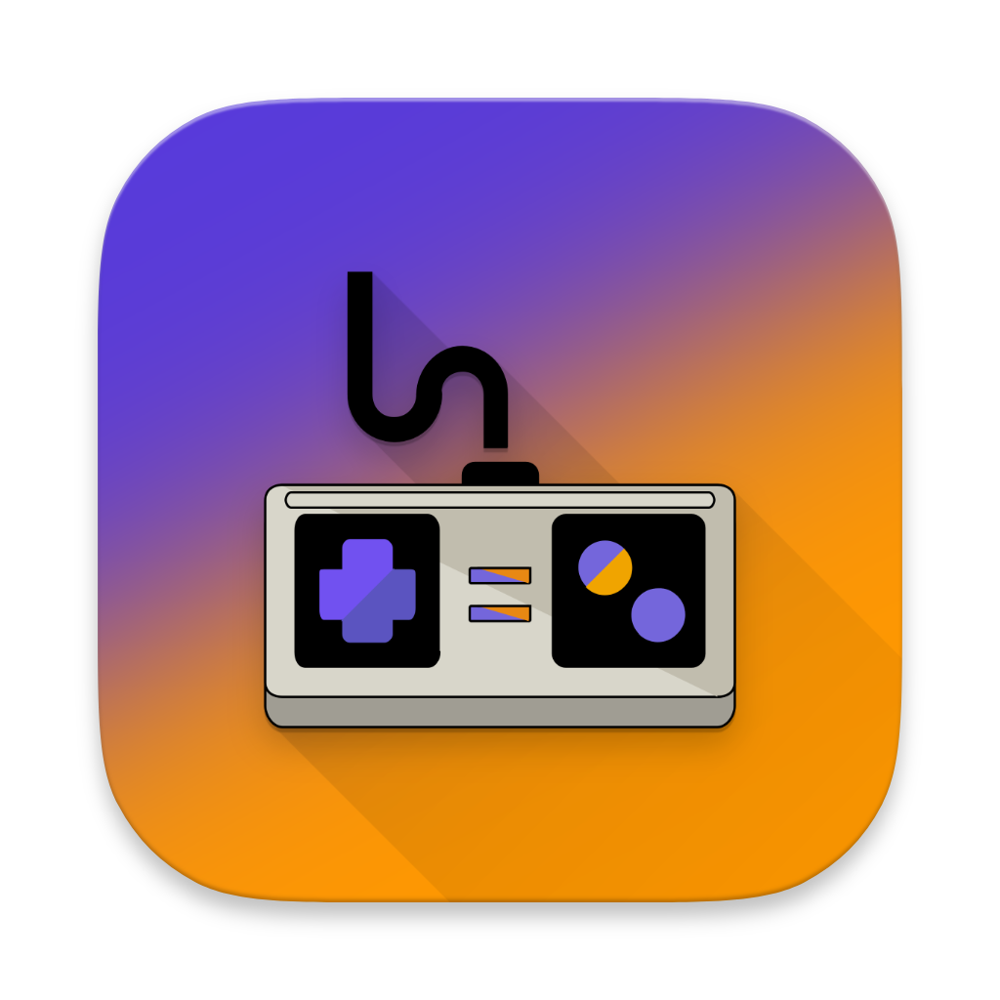

<div align="center">



# Retro Multi Tools


A cross-platform desktop utility for managing, inspecting, modifying, patching & launching retro game ROMs.

[](LICENSE)
[](https://dotnet.microsoft.com/download/dotnet/8.0)
[](#)

</div>

## Table of Contents

- [Downloads](#downloads)
- [Platform Guides](#platform-guides)
- [Documentation](#documentation)
- [Features](#features)
- [Supported Systems](#supported-systems)
- [Keyboard Shortcuts](#keyboard-shortcuts)
- [Localization](#localization)
- [Building from Source](#building-from-source)
- [Contributing](#contributing)
- [License](#license)

## Downloads

Download the latest release from the [Releases](https://github.com/SvenGDK/RetroMultiTools/releases) page.
All release builds are self-contained — no separate .NET runtime installation is required.

| Platform | Architectures | Formats |
|---|---|---|
| **Windows** | x64, ARM64 | ZIP, Installer (`.exe`) |
| **Linux** | x64, ARM64 | ZIP, DEB, RPM, APK, Pacman, AppImage, Snap, Flatpak |
| **macOS** | Intel, Apple Silicon | ZIP, PKG, DMG |
| **FreeBSD** | x64, ARM64 | ZIP, PKG |

## Platform Guides

- **Windows** — Extract the ZIP and run `RetroMultiTools.exe`, or use the Inno Setup installer.
- **Linux** — See [LINUX.md](LINUX.md) for DEB, RPM, APK, Pacman, AppImage, Snap, and Flatpak instructions.
- **macOS** — See [macOS.md](macOS.md) for PKG, DMG, and Gatekeeper instructions.
- **FreeBSD** — See [FreeBSD.md](FreeBSD.md) for Linux binary compatibility setup and PKG instructions.

## Documentation

For detailed user guides and reference material, see the **[full documentation](docs/README.md)**.

| Guide | Description |
|---|---|
| [Installation](docs/getting-started/installation.md) | Download and install on all platforms |
| [First Steps](docs/getting-started/first-steps.md) | Get up and running in minutes |
| [ROM Browser Guide](docs/guides/rom-browser-guide.md) | Browse, manage, and launch ROMs |
| [Big Picture Mode](docs/guides/big-picture-mode.md) | Fullscreen, controller-friendly ROM library |
| [Keyboard Shortcuts](docs/configuration/keyboard-shortcuts.md) | All shortcuts in one place |
| [Troubleshooting](docs/troubleshooting.md) | Common issues and solutions |

## Features

### Browsing & Inspection

- **ROM Browser** — Scan directories for ROMs across 46 systems, filter by system, view box art and screenshots, send ROMs to remote targets (FTP, SFTP, WebDAV, S3, cloud storage), host on local network via built-in HTTP server
- **Big Picture Mode** — Fullscreen, controller-friendly library with card grid, favorites, recently played, ROM Info overlay, grid zoom, play statistics, and RetroArch/MAME/Mednafen launching
- **ROM Inspector** — Detect system type from headers, parse detailed header info, fetch artwork from [Libretro Thumbnails](https://github.com/libretro-thumbnails)
- **Hex Viewer** — View ROM contents in hex with ASCII sidebar, page navigation, offset jump, byte pattern search

### Patching

- **ROM Patcher** — Apply IPS (with RLE), BPS (with CRC32 validation), and xDelta/VCDIFF (RFC 3284) patches
- **IPS Patch Creator** — Create IPS patches by comparing original and modified ROMs with RLE compression (up to 16 MB)

### Conversion & Extraction

- **N64 Format Converter** — Convert between `.z64`, `.n64`, and `.v64` byte orders with auto-detection
- **ROM Format Converter** — Add/remove copier headers, fix iNES headers, convert disc images to CHD or RVZ; single file or batch
- **Save File Converter** — Convert between save formats (`.sav`, `.srm`, `.eep`, `.fla`, `.sra`), swap endianness, pad/trim for flash cart compatibility
- **Archive Manager** — Extract from ZIP/RAR/7z/GZip, create ZIP archives; batch extraction and creation
- **Split ROM Assembler** — Reassemble split ROM files (`.001`/`.002`, `.part1`/`.part2`, `.z01`/`.z02`)

### Verification & Analysis

- **Checksum Calculator** — Compute CRC32, MD5, SHA-1, SHA-256 with streaming I/O for large files
- **ROM Comparer** — Byte-by-byte binary comparison with mismatch offset reporting
- **DAT Verifier** — Verify ROMs against No-Intro/TOSEC DAT files by CRC32, MD5, or SHA-1; single or batch
- **DAT Filter** — Filter DAT entries by category, region, language; 1G1R deduplication; export as Logiqx XML
- **Dump Verifier** — Check for overdumps, underdumps, blank regions, bad headers, and size validation
- **Duplicate Finder** — Find duplicate ROMs by CRC32 hash, show wasted space, delete duplicates with confirmation
- **Batch ROM Hasher** — Hash all ROMs in a directory; export as CSV, text, SFV, or MD5 sum file
- **Security & DRM Analysis** — Detect region locking, copy protection (10NES, CIC, TMSS, etc.), and validate internal checksums; single or batch
- **GoodTools Identifier** — Decode GoodTools filename tags (country codes, dump status, special codes)

### ROM Management

- **Header Export** — Export ROM header info to text or CSV; batch export with system summary
- **SNES Copier Header Tool** — Detect, add, and remove 512-byte copier headers
- **Batch Header Fixer** — Fix headers for 19 systems (SNES, NES, GB/GBC, GBA, Mega Drive, N64, DS, and more)
- **ROM Trimmer** — Trim trailing padding bytes with power-of-two alignment
- **ROM Renamer** — Rename ROMs based on header-detected titles; preview before applying; batch support
- **Metadata Scraper** — Scrape header info and checksums in bulk; export to CSV or text
- **ROM Organizer** — Auto-sort ROMs into system folders; copy or move mode; skip duplicates

### Cheats & Emulation

- **Cheat Code Converter** — Decode/encode Game Genie, Pro Action Replay, GameShark, CodeBreaker, and raw codes for 15+ systems
- **Emulator Config Generator** — Generate configs for RetroArch, Mesen, Snes9x, Project64, mGBA, Kega Fusion, Mednafen, Stella, FCEUX, and MAME

### Disc Tools

- **Disc Burning & Image Creation** — Burn disc images or data to optical media, create ISOs from discs or files; cross-platform (IMAPI2, cdrecord/wodim, hdiutil/drutil)

### USB Tools

- **USB Drive Management** — File explorer, format drives (FAT/FAT32/exFAT/NTFS, MBR/GPT), write/create disk images; cross-platform

### MAME

- **MAME Integration** — Auto-detect MAME path, launch arcade ROMs, Discord Rich Presence
- **MAME Configurator** — Generate and manage MAME configuration settings
- **ROM Set Auditor** — Audit ROM sets against MAME XML for completeness, checksums, and clone relationships
- **CHD Verifier** — Validate CHD v3/v4/v5 headers, checksums, and parent dependencies; single or batch
- **CHD Converter** — Compress disc images to CHD or decompress back; multi-processor support
- **DAT Editor** — Edit Logiqx XML DAT files: machines, ROMs, disks, samples, with search and statistics
- **ROM Set Rebuilder** — Rebuild ROM sets in Split, Non-Merged, or Merged mode from loose files or ZIPs
- **Dir2Dat Creator** — Create DAT files from directories with CRC32/SHA-1/MD5 checksums and CHD support
- **Sample Auditor** — Audit MAME sample sets for missing WAV files and shared sample references

### RetroArch

- **RetroArch Integration** — Auto-detect path, launch ROMs with core selection, core downloader (official buildbot)
- **RetroArch Configurator** — Generate and manage RetroArch configuration settings
- **RetroArch Playlist Creator** — Create/edit `.lpl` playlists with thumbnail downloading from Libretro
- **RetroArch Shortcut Creator** — Create desktop shortcuts (`.lnk`, `.desktop`, `.command`) with core and icon selection
- **RetroAchievements Writer** — Create/edit RACache achievement files with validation and 78 console IDs

### Mednafen

- **Mednafen Integration** — Auto-detect path, launch ROMs with automatic module selection for 13 systems, Discord Rich Presence
- **Mednafen Configurator** — Generate and manage Mednafen configuration settings

### Analogue Hardware

- **Analogue Pocket** — Manage openFPGA cores, export screenshots, backup/restore saves, extract Game Boy Camera photos, generate library images, SD card validation
- **Analogue Mega SG** — Generate custom fonts, convert save files with endianness swapping
- **Analogue NT / Super NT** — Generate custom fonts, repair NES ROM headers
- **Analogue 3D** — Manage N64 Game Paks with per-game display/hardware settings and custom label artwork

### Settings & System

- **Application Updates** — Auto-check for updates with in-app download and external updater process
- **Controller Profiles** — Download SDL2 controller profiles from [SDL_GameControllerDB](https://github.com/gabomdq/SDL_GameControllerDB)
- **SDL2 Gamepad Mapping Tool** — Step-by-step wizard to create custom controller mappings for Big Picture Mode
- **Gamepad Key Mapper** — Map gamepad inputs to keyboard/mouse/scripts/macros with multi-profile system, auto-profile rules, and macro recording
- **Discord Rich Presence** — Show current game and system in Discord status during RetroArch, MAME, or Mednafen gameplay
- **Native Menu** — Platform-native application menu on macOS and Linux
- **System Tray** — Minimize to tray during gameplay with auto-restore when emulator exits

## Supported Systems

46 consoles, computers, and handhelds are supported. See [full system reference](docs/reference/supported-systems.md) for the feature coverage matrix (header parsing, security analysis, dump verification, cheat codes, header fixing).

<details>
<summary>System list with file extensions</summary>

| System | Extensions |
|---|---|
| Amiga CD32 | `.iso`, `.cue` |
| Amstrad CPC | `.dsk`, `.cdt`, `.sna` |
| Arcade (MAME) | `.zip`, `.7z` |
| Atari 2600 | `.a26` |
| Atari 5200 | `.a52` |
| Atari 7800 | `.a78` |
| Atari 800 / XL / XE | `.atr`, `.xex`, `.car`, `.cas` |
| Atari Jaguar | `.j64`, `.jag` |
| Atari Lynx | `.lnx`, `.lyx` |
| Coleco ColecoVision | `.col`, `.cv` |
| Fairchild Channel F | `.chf` |
| Game Boy | `.gb` |
| Game Boy Advance | `.gba` |
| Game Boy Color | `.gbc` |
| Mattel Intellivision | `.int` |
| Memotech MTX | `.mtx`, `.run` |
| MSX | `.mx1` |
| MSX2 | `.mx2` |
| NEC PC-88 | `.d88`, `.t88` |
| Nintendo 3DS | `.3ds`, `.cia` |
| Nintendo 64 | `.z64`, `.n64`, `.v64` |
| Nintendo 64DD | `.ndd` |
| Nintendo DS | `.nds` |
| Nintendo Entertainment System (NES) | `.nes` |
| Nintendo GameCube | `.gcm`, `.iso` |
| Nintendo Virtual Boy | `.vb`, `.vboy` |
| Nintendo Wii | `.iso` |
| Oric / Atmos / TeleStrat | `.tap` |
| Panasonic 3DO | `.3do`, `.iso`, `.cue` |
| PC Engine / TurboGrafx-16 | `.pce`, `.tg16` |
| Philips CD-i | `.iso`, `.cue` |
| Radio Shack Color Computer | `.ccc` |
| Sega 32X | `.32x` |
| Sega CD | `.iso`, `.cue` |
| Sega Dreamcast | `.cdi`, `.gdi`, `.iso`, `.cue` |
| Sega Game Gear | `.gg` |
| Sega Master System | `.sms` |
| Sega Mega Drive / Genesis | `.md`, `.gen`, `.bin` |
| Sega Saturn | `.iso`, `.cue` |
| SNK Neo Geo | `.neo` |
| SNK Neo Geo CD | `.iso`, `.cue` |
| SNK Neo Geo Pocket / Pocket Color | `.ngp`, `.ngc` |
| Super Nintendo (SNES) | `.smc`, `.sfc` |
| Thomson MO5 | `.mo5`, `.k7`, `.fd` |
| Tiger Game Com | `.tgc` |
| Watara Supervision | `.sv` |

</details>

## Keyboard Shortcuts

| Shortcut | Action |
|---|---|
| `Ctrl+F` / `Ctrl+K` | Focus sidebar search |
| `Escape` | Clear search or unfocus |
| `F1` | Open guided tour overlay |

**Big Picture Mode** — Arrow keys to browse, Enter/Space to launch, `F` to toggle favorite, `I` for ROM Info, `+`/`−` to zoom grid, `H` or `?` for help overlay, `Tab` to search, `Escape` to exit. Full gamepad support via SDL2.

See [all keyboard shortcuts](docs/configuration/keyboard-shortcuts.md) for the complete reference.

## Localization

Available in **20 languages**: English, Spanish, French, German, Portuguese, Italian, Japanese, Chinese (Simplified), Korean, Russian, Dutch, Polish, Turkish, Arabic, Hindi, Thai, Swedish, Czech, Vietnamese, Indonesian.

## Building from Source

Requires the [.NET 8 SDK](https://dotnet.microsoft.com/download/dotnet/8.0).

```bash
git clone https://github.com/SvenGDK/RetroMultiTools.git
cd RetroMultiTools
dotnet build
dotnet run --project RetroMultiTools
```

The solution contains two projects:

| Project | Description |
|---|---|
| `RetroMultiTools` | Main Avalonia desktop application |
| `RetroMultiTools.Updater` | External updater — applies downloaded updates after the main app exits |

See [Building from Source](docs/development/building.md) for publish commands and platform-specific notes, and [Project Structure](docs/development/project-structure.md) for the full architecture overview.

## Contributing

Contributions are welcome! To get started:

1. Fork the repository
2. Create a feature branch (`git checkout -b feature/my-feature`)
3. Make your changes and verify the build passes (`dotnet build`)
4. Commit and push to your fork
5. Open a pull request

Please see [Building from Source](docs/development/building.md) for development setup and [Project Structure](docs/development/project-structure.md) for an overview of the codebase.

## License

BSD 2-Clause License — see [LICENSE](LICENSE) for details.
